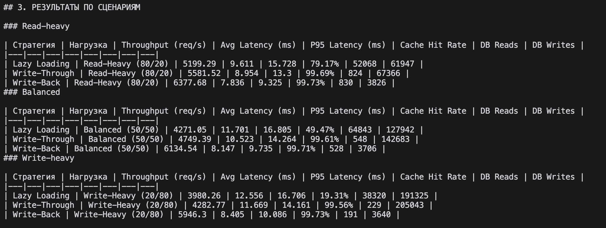

# ОТЧЕТ: СРАВНЕНИЕ СТРАТЕГИЙ КЕШИРОВАНИЯ

---

## 1. УСЛОВИЯ ТЕСТИРОВАНИЯ

| Параметр | Значение |
|---|---|
| Архитектура | FastAPI + Redis + PostgreSQL |
| Развертывание | Docker |
| Количество записей | 1000 |
| Длительность теста | 60 сек |
| Конкурентность | 50 воркеров |
| Количество тестов | 9 |

### Типы нагрузки

- **Read-heavy** — 80% чтение / 20% запись  
- **Balanced** — 50% чтение / 50% запись  
- **Write-heavy** — 20% чтение / 80% запись  

---

## 2. СВОДНЫЕ РЕЗУЛЬТАТЫ

| Стратегия | Нагрузка | Throughput (req/s) | Avg Latency (ms) | P95 (ms) | Cache Hit | DB Reads | DB Writes |
|---|---|---|---|---|---|---|---|
| Lazy | Read-heavy | 5199 | 9.6 | 15.7 | 79% | 52k | 61k |
| Lazy | Balanced | 4271 | 11.7 | 16.8 | 49% | 64k | 127k |
| Lazy | Write-heavy | 3980 | 12.6 | 16.7 | 19% | 38k | 191k |
| Write-Through | Read-heavy | 5581 | 8.9 | 13.3 | 99.7% | 824 | 67k |
| Write-Through | Balanced | 4749 | 10.5 | 14.2 | 99.6% | 548 | 142k |
| Write-Through | Write-heavy | 4282 | 11.7 | 14.1 | 99.5% | 229 | 205k |
| Write-Back | Read-heavy | **6377** | **7.8** | **9.3** | 99.7% | 830 | **3.8k** |
| Write-Back | Balanced | **6134** | **8.1** | **9.7** | 99.7% | 528 | **3.7k** |
| Write-Back | Write-heavy | **5946** | **8.4** | **10.0** | 99.7% | 191 | **3.6k** |

---

## 3. АНАЛИЗ РЕЗУЛЬТАТОВ

### Read-heavy

В сценарии с преобладанием чтения лучший throughput показала стратегия **Write-Back**:

- Write-Back — **6377 req/sec**  
- Write-Through — 5581 req/sec  
- Lazy Loading — 5199 req/sec  

Write-Back заметно опережает остальные стратегии благодаря тому, что практически все операции выполняются в кеше, а обращения к БД минимальны.

Write-Through также показывает хорошие результаты:
- высокий cache hit (~99%)
- низкое количество DB reads

Lazy Loading уступает:
- ниже cache hit (~79%)
- больше обращений к БД
- выше задержки

В данном тесте **Write-Back является лидером**, но преимущество достигается за счет отложенной записи.

---

### Balanced

В смешанной нагрузке снова лидирует **Write-Back**:

- Write-Back — **6134 req/sec**  
- Write-Through — 4749 req/sec  
- Lazy Loading — 4271 req/sec  

Write-Back показывает:
- на ~30% выше throughput
- минимальную latency (~8 ms)
- практически отсутствие нагрузки на БД

Write-Through занимает второе место:
- стабильный cache hit (~99%)
- но высокая нагрузка на DB writes

Lazy Loading показывает худший результат:
- cache hit падает до ~49%
- частые cache miss из-за записей

В отличие от классических ожиданий, **Write-Back здесь значительно эффективнее**, так как batching снимает нагрузку с БД.

---

### Write-heavy

В сценарии с преобладанием записи разрыв становится максимальным:

- Write-Back — **5946 req/sec**  
- Write-Through — 4282 req/sec  
- Lazy Loading — 3980 req/sec  

Ключевое отличие:

- Write-Back:
  - ~3600 записей в БД
- Write-Through:
  - ~205000 записей
- Lazy:
  - ~191000 записей

Разница более чем **в 50 раз по количеству операций записи в БД**.

Write-Back:
- завершает запись сразу (в кеш)
- отправляет данные в БД батчами

Write-Through и Lazy:
- нагружают БД на каждую операцию

Поэтому **Write-Back значительно выигрывает по throughput и latency**.

---

## 4. ВЫВОДЫ

### Для чтения

Лучший результат показал **Write-Back**.

Он обеспечивает:
- максимальный throughput
- минимальную latency
- почти полное отсутствие нагрузки на БД

Однако:
- данные записываются в БД с задержкой

Если важна консистентность:
- разумный выбор — **Write-Through**

---

### Для записи

Лучший вариант — **Write-Back**.

Причины:
- запись завершается в кеше
- нет ожидания БД
- используется batching

Это дает:
- минимальную latency
- максимальный throughput
- резкое снижение нагрузки на БД

Недостаток:
- риск потери данных при сбое

---

### Для смешанной нагрузки

Лучший результат — **Write-Back**.

Он:
- показывает максимальный throughput
- сохраняет низкую latency
- практически устраняет нагрузку на БД

Однако:
- система становится eventually consistent

Если требуется баланс:
- **Write-Through** — наиболее предсказуемый вариант

---

## 5. ОБЩИЙ ВЫВОД

- **Write-Back** — самая производительная стратегия во всех сценариях  
- **Write-Through** — оптимальный компромисс между скоростью и надежностью  
- **Lazy Loading** — уступает по большинству метрик  

Главный вывод:

> Производительность системы определяется количеством операций с БД.  
> Чем меньше обращений к БД — тем выше throughput и ниже latency.

Write-Back достигает лучших результатов именно за счет:
- batching
- асинхронной записи
- переноса нагрузки в память

---

## 6. ОСОБЕННОСТЬ WRITE-BACK

- Dirty keys (в середине теста): ~980  
- DB writes: ~3600  
- Всего запросов: ~350k  

Это означает:
- большинство данных находится в кеше в измененном состоянии
- БД обновляется с задержкой

---

## 8. Скриншоты выполнения

### Запуск тестов

### Результаты Write-Back

### Финальный отчет
