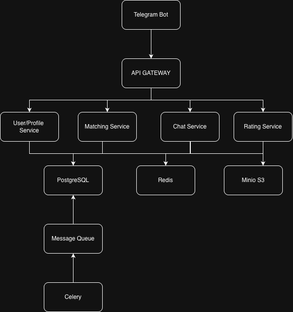
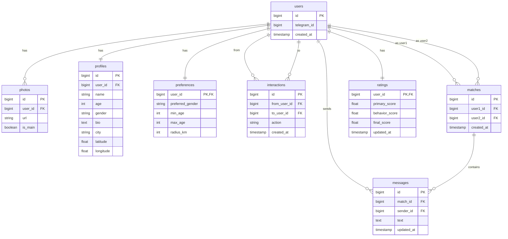

# Описание микросервисов

В системе реализовано 4 микросервиса, каждый из которых отвечает за отдельную часть функциональности приложения.

---

## User & Profile Service

Отвечает за работу с пользователями и их анкетами.

**Функциональность:**

- Регистрация через Telegram ID
- Хранение личных данных: имя, возраст, пол, описание, геолокация
- Управление фотографиями
- Настройка предпочтений для поиска: возраст, пол, радиус

**Технологии:**

- Python + FastAPI
- PostgreSQL
- SQLAlchemy / Alembic
- Pydantic
- Minio (S3) для хранения фотографий

---

## Matching Service

Отвечает за логику знакомств.

**Функциональность:**

- Формирование ленты анкет с учётом предпочтений и рейтинга
- Обработка лайков и пропусков
- Создание мэтчей при взаимной симпатии

**Технологии:**

- Python + FastAPI
- Redis для кэширования ленты анкет
- RabbitMQ / Kafka для обмена событиями

---

## Chat Service

Отвечает за обмен сообщениями между пользователями.

**Функциональность:**

- Отправка и получение сообщений после создания мэтча
- Хранение истории переписки
- Получение списка сообщений по диалогу

**Технологии:**

- Python + FastAPI
- PostgreSQL
- RabbitMQ для взаимодействия с другими сервисами
- Celery для фоновых задач

---

## Rating Service

Отвечает за расчёт рейтинга пользователей.

**Функциональность:**

- Трёхуровневая система рейтингов: первичный, поведенческий, итоговый
- Обновление рейтингов через фоновые задачи
- Учёт активности пользователей и реферальной системы
- Получение событий: лайки, мэтчи, приглашения друзей

**Технологии:**

- Python + FastAPI
- PostgreSQL
- Pydantic для валидации данных

---

## Дополнительно используемые компоненты

- **Redis** — кэширование анкет для ускорения выдачи
- **Message Queue (RabbitMQ / Kafka)** — обмен событиями между сервисами
- **Celery** — выполнение фоновых задач (пересчёт рейтингов)
- **Minio (S3)** — хранение фотографий

---

## Схема архитектуры

Пользователь через Telegram-бота отправляет запросы в систему через API Gateway.  
Запросы распределяются между микросервисами: User/Profile, Matching, Chat, Rating.  

Сервисы обмениваются данными через API и очередь сообщений, используют общую базу данных, кэш Redis для ускорения работы и хранилище Minio для изображений.  
Фоновые задачи выполняются через Celery.

  

## Схема данных для БД

