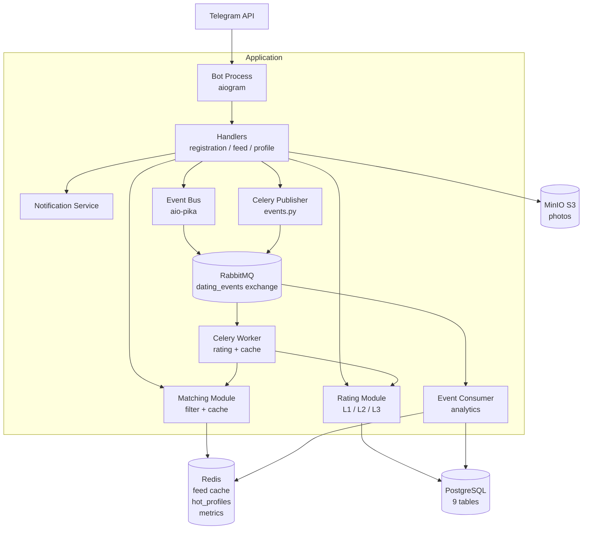
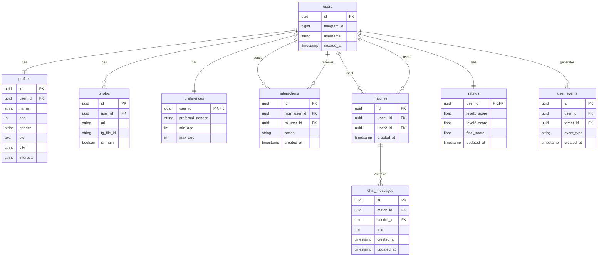

# forpeep — Отчёт по архитектуре и реализации

**СУБД:** PostgreSQL 16 (Docker)  
**Брокер:** RabbitMQ 3.13 (Docker)  
**Кэш:** Redis 7 (Docker)  
**Хранилище:** MinIO (S3-compatible, Docker)  
**Фреймворк:** aiogram 3.27, Python 3.13  

---

## 1. Архитектурное решение

### 1.1. Тип архитектуры

Система реализована как **монолитное приложение**, разделённое на логические модули с чёткими границами ответственности. Это сознательный выбор для учебного проекта: монолит проще отлаживать, всё находится в одной кодовой базе, но при этом каждый модуль можно вынести в отдельный сервис без переписывания логики.

Монолит состоит из шести логических компонентов:

| Компонент | Описание |
|-----------|---------|
| **Bot Layer** | Обработка Telegram-обновлений, FSM, клавиатуры |
| **Profile Module** | Управление пользователями и анкетами |
| **Matching Module** | Лента, фильтрация, кэш |
| **Rating Module** | Трёхуровневый рейтинг |
| **Background Jobs** | Celery задачи + beat расписание |
| **Services Layer** | Notifications, Event Consumer |

### 1.2. Роль Message Queue

В данной архитектуре RabbitMQ используется **двумя независимыми способами**:

**Способ 1 — через Celery (тяжёлые задачи):**
Celery использует RabbitMQ как брокер задач. Когда происходит лайк, в очередь отправляется задача `process_like_event`, которую Celery worker забирает и выполняет: пересчитывает рейтинг, записывает аналитику, прогревает кэш. Это разгружает бота от тяжёлых синхронных операций.

**Способ 2 — прямой AMQP через aio-pika (event bus):**
Параллельно с Celery бот публикует события в exchange `dating_events` через библиотеку `aio-pika`. Отдельный процесс `event_consumer.py` подписывается на этот exchange и обрабатывает события в реальном времени: обновляет Redis-счётчики, пишет почасовую статистику. Это классический event-driven паттерн с независимыми consumers.

```
Telegram Bot
     │
     ├──► aio-pika ──► exchange dating_events ──► event-consumer
     │                                              (real-time analytics)
     │
     └──► Celery.delay() ──► RabbitMQ queue ──► celery-worker
                                                 (rating / cache / DB)
```

### 1.3. Архитектурная схема



---

## 2. Схема базы данных

### 2.1. Таблицы и связи



### 2.2. Индексы

Для производительности созданы следующие индексы:

| Таблица | Индекс | Цель |
|---------|--------|------|
| `profiles` | `(gender, age)` | Фильтрация ленты по предпочтениям |
| `ratings` | `final_score DESC` | Сортировка кандидатов |
| `interactions` | `(from_user_id, to_user_id, action)` | Поиск реверс-лайка O(log n) |
| `interactions` | `(to_user_id, action)` | Подсчёт полученных лайков |
| `interactions` | `created_at` | Временная активность (L2) |
| `matches` | `(user1_id, user2_id)` | Поиск существующего мэтча |
| `user_events` | `(event_type, created_at)` | Аналитические запросы |
| `photos` | `(user_id, is_main)` | Быстрое получение главного фото |

### 2.3. Нормализация

- `profiles` и `preferences` вынесены в отдельные таблицы (1:1 с users) — профиль и предпочтения изменяются независимо
- `photos` — отдельная таблица (1:N) — один пользователь, несколько фото
- `ratings` — хранит предрасчитанные значения, не вычисляются на лету при запросе
- `user_events` — аналитическая таблица, не участвует в основной бизнес-логике

---

## 3. Система рейтинга

### 3.1. Level 1 — Полнота анкеты

**Назначение:** Отражает качество профиля пользователя как контента. Не зависит от поведения других пользователей.

**Формула:**

```
score = 0
if profile exists:
    score += 2  # name
    score += 2  # age
    score += 2  # gender
    if bio:      score += 2
    if city:     score += 2
    if interests: score += 2
if photos == 1:  score += 1
if photos >= 2:  score += 2

level1_score = min(score / 14 * 10, 10.0)
```

**Почему такие веса:** Базовые поля (имя, возраст, пол) обязательны — без них анкета не создаётся. Дополнительные поля (bio, город, интересы, фото) — сигнал вовлечённости пользователя. Профили с фото и описанием получают больше лайков на практике.

### 3.2. Level 2 — Поведенческий рейтинг

**Назначение:** Отражает реальную привлекательность пользователя на основе действий других пользователей. Пересчитывается асинхронно после каждого лайка.

**Формула:**

```
A) Объём лайков (0–4):
   like_volume = min(likes_received / 50, 1.0) × 4

B) Соотношение лайков к просмотрам (0–3):
   ratio = (likes_received / total_received) × 3

C) Конверсия лайк → мэтч (0–3):
   match_rate = min(matches / likes_received, 1.0) × 3

D) Временная активность (0–2):
   если последнее действие ≤ 7 дней → +2
   если последнее действие ≤ 30 дней → +1
   иначе → 0

level2_score = min(A + B + C + D, 10.0)
```

**Почему temporal activity важна:** Неактивный пользователь не ответит на сообщение. Ранжировать активных пользователей выше — это честно по отношению к тем, кто ставит лайки.

### 3.3. Level 3 — Итоговый рейтинг с дополнительными факторами

**Назначение:** Объединяет L1 и L2, добавляет фактор свежести аккаунта.

**Формула:**

```
# Базовый балл
if total_received_interactions == 0:
    base = level1_score          # новый аккаунт — показываем по L1
else:
    base = level1 × 0.3 + level2 × 0.7

# Дополнительный фактор — свежесть профиля
account_age_days = (now - user.created_at).days
if account_age_days ≤ 7:   freshness = 1.15  # +15%
if account_age_days ≤ 30:  freshness = 1.05  # +5%
else:                       freshness = 1.00

final_score = min(base × freshness, 10.0)
```

**Зачем freshness multiplier:** Новые пользователи не имеют поведенческой истории, но их анкету нужно показать другим, чтобы получить первые взаимодействия. Небольшой буст помогает им войти в систему. Через 30 дней буст убирается — рейтинг полностью определяется реальными данными.

**Распределение весов L1:L2 = 0.3:0.7** — поведенческий сигнал важнее статического контента, потому что реальная привлекательность профиля лучше всего выражается через то, как на него реагируют другие пользователи.

---

## 4. Redis — кэширование и аналитика

### 4.1. Feed Cache (FIFO батч)

**Проблема без кэша:** При каждом нажатии «следующая анкета» выполняется тяжёлый SQL запрос с JOIN, фильтрами и сортировкой по `final_score`. При тысячах пользователей это создаёт постоянную нагрузку.

**Решение:** Загружать 10 кандидатов за раз и хранить их в Redis. Каждый запрос — это `GET` + `SET` (O(1)) вместо полного SQL.

```python
# При первом запросе или пустом кэше:
candidates = SELECT 10 FROM users
             JOIN profiles ON profiles.user_id = users.id
             LEFT JOIN ratings ON ratings.user_id = users.id
             WHERE gender = pref AND age BETWEEN min AND max
               AND id NOT IN (already interacted)
             ORDER BY final_score DESC
             LIMIT 10

# Сохранить в Redis:
redis.set(f"feed:{user_id}", json.dumps([str(id) for id in candidates[1:]]), ex=3600)

# При повторных запросах:
ids = json.loads(redis.get(f"feed:{user_id}"))
next_id = ids.pop(0)
redis.set(f"feed:{user_id}", json.dumps(ids), ex=3600)
```

Батч из 10 анкет покрывает среднюю сессию пользователя. После исчерпания батча следующий запрос снова идёт в БД.

### 4.2. Hot Profiles Sorted Set

Обновляется каждые 30 минут через Celery Beat:

```python
ZADD hot_profiles {user_id: final_score, ...}
# Ключ хранит топ-100 пользователей, сортированных по final_score
# TTL 30 минут
```

Используется для быстрого получения топ-кандидатов без полного скана `ratings`.

### 4.3. Real-time Metrics

```python
# Ежедневные счётчики (TTL 3 дня):
INCR metrics:likes:2026-05-15
INCR metrics:skips:2026-05-15
INCR metrics:matches:2026-05-15

# Почасовые паттерны (hash: hour → count):
HINCRBY metrics:hourly:2026-05-15:like  "14"  1
# Позволяет строить график: "в какое время суток больше всего лайков"

# Активные пользователи (HyperLogLog — точный подсчёт без дублей):
PFADD metrics:active_users:2026-05-15  user_id
PFCOUNT metrics:active_users:2026-05-15  → ~100 (±1%)
```

---

## 5. Celery — фоновые задачи

### 5.1. Зачем Celery, а не просто asyncio

Основная причина — тяжёлые операции не должны замедлять ответ бота. Пользователь нажал «лайк» и ждёт следующую анкету. Пересчёт рейтинга (4 SQL-запроса + UPDATE) должен выполниться в фоне, а бот немедленно покажет следующую карточку.

Дополнительно: Celery даёт retry-логику (до 3 попыток с паузой), расписание задач (beat), мониторинг через Flower, масштабирование через `-c N` workers.

### 5.2. Все задачи

| Задача | Тип | Триггер | Что делает |
|--------|-----|---------|-----------|
| `process_like_event` | Event-driven | После лайка | Записывает UserEvent в БД, пересчитывает рейтинг recipient |
| `process_skip_event` | Event-driven | После скипа | Записывает UserEvent в БД |
| `process_match_event` | Event-driven | При мэтче | Записывает UserEvent, пересчитывает рейтинг обоих |
| `process_message_event` | Event-driven | При сообщении | Записывает messaging event |
| `warm_user_feed_cache` | Event-driven | После каждого действия | Предзагружает следующий батч в Redis |
| `recalculate_all_ratings` | Periodic | Каждый час | Пересчёт рейтинга всех пользователей |
| `warm_active_users_cache` | Periodic | Каждые 15 мин | Прогрев кэша для активных пользователей |
| `refresh_hot_profiles` | Periodic | Каждые 30 мин | Обновление sorted set в Redis |
| `cleanup_old_data` | Periodic | Ежедневно 03:00 | Удаление UserEvent старше 90 дней |
| `recalculate_user_rating` | Event-driven | Legacy alias | Пересчёт рейтинга одного пользователя |

### 5.3. Retry-логика

```python
@celery_app.task(bind=True, max_retries=3)
def process_like_event(self, from_id, to_id):
    try:
        # ... бизнес-логика
    except Exception as exc:
        raise self.retry(exc=exc, countdown=10)  # повтор через 10 сек
```

Если RabbitMQ временно недоступен или БД перегружена — задача будет повторена до 3 раз с нарастающей паузой.

---

## 6. MinIO — хранение фотографий

### 6.1. Почему S3, а не файловая система

- **Масштабируемость:** Файловая система ограничена одним сервером, MinIO — горизонтально масштабируемо
- **URL-доступ:** Фото доступны по HTTP URL — можно использовать в веб-версии
- **Presigned URLs:** Временный доступ к приватным объектам без открытия публичного доступа
- **CDN-совместимость:** Можно поставить CDN перед MinIO

### 6.2. Схема загрузки

```
Пользователь отправляет фото в Telegram
    │
    ▼
Bot скачивает байты через bot.get_file() + bot.download_file()
    │
    ▼
storage.upload_photo(bytes, user_id)
    │
    ├──► MinIO: PUT /photos/users/{user_id}/{uuid}.jpg
    │         → возвращает URL: http://minio:9000/photos/users/.../uuid.jpg
    │
    └── Fallback: если MinIO недоступна → сохраняем tg_file_id
    │
    ▼
В БД записывается:
    Photo(url=minio_url, tg_file_id=tg_file_id, is_main=True)
```

В базе хранится **только URL** — файлы никогда не попадают в PostgreSQL.

При отображении анкеты в боте используется `tg_file_id` (более эффективно для Telegram API). URL в MinIO используется для внешних клиентов (веб-версия и т.д.).

---

## 7. Notification Service

### 7.1. Зачем выносить уведомления в отдельный сервис

Изначально логика уведомлений была встроена прямо в feed-хендлер. Это создавало проблемы:
- хендлер нёс ответственность за 4 разные вещи (запись interaction, мэтч-проверка, уведомление, следующая анкета)
- уведомления дублировались в разных местах
- сложно тестировать

Notification Service (`app/services/notifications.py`) инкапсулирует всю логику доставки уведомлений:

```python
notifier = NotificationService(bot)
await notifier.notify_like(liker, liker_profile, liked_user, session)
await notifier.notify_match(user1, user1_profile, user2, user2_profile)
```

Feed-хендлер теперь только принимает решение **что** уведомить, сервис решает **как**.

### 7.2. Обработка ошибок

Все методы NotificationService поглощают исключения:

```python
try:
    await self.bot.send_photo(...)
except TelegramForbiddenError:
    # Пользователь заблокировал бота — логируем, не падаем
    logger.warning("Like notification blocked → user %s", user.telegram_id)
except Exception:
    logger.exception("Like notification failed")
```

Уведомление — это вторичное действие. Если не удалось отправить, основная транзакция (запись лайка) уже выполнена.

---

## 8. Event Consumer — аналитический сервис

### 8.1. Архитектура

`app/services/event_consumer.py` — самостоятельный процесс, подписанный на exchange `dating_events` в RabbitMQ через `aio-pika`.

```python
exchange = await channel.declare_exchange("dating_events", ExchangeType.TOPIC, durable=True)
queue    = await channel.declare_queue("analytics", durable=True)
await queue.bind(exchange, routing_key="event.*")  # подписка на все события
```

Получает события:
- `event.like` — `{from_user_id, to_user_id}`
- `event.skip` — `{from_user_id, to_user_id}`
- `event.match` — `{user1_id, user2_id}`
- `event.message` — `{sender_id, match_id}`

### 8.2. Что делает с событиями

```python
async def _handle_event(event_type, payload, redis):
    await increment_event(event_type, redis)      # INCR daily counter
    await record_hourly_activity(event_type, redis) # HINCRBY hourly hash
    record_event_sync(event_type, from_id, to_id)   # INSERT UserEvent в DB
```

### 8.3. Почему отдельный процесс

Event Consumer полностью независим от Celery. Если остановить Celery worker — аналитика продолжит работу. Это демонстрирует настоящую событийно-ориентированную архитектуру: разные consumers обрабатывают одни и те же события независимо.

---

## 9. CI/CD — GitHub Actions

### 9.1. Pipeline

Файл: `.github/workflows/ci.yml`

При каждом push/PR запускаются три параллельных job:

```
push to main/develop
        │
        ├──► [test]    Python 3.13 + pytest
        │              Устанавливает: pytest, pytest-asyncio, sqlalchemy, redis, python-dotenv
        │              Запускает: python -m pytest tests/ -v --tb=short
        │              Проходит: 31/31 тестов
        │
        ├──► [lint]    ruff check app/ --select=E,F,W
        │              Проверяет синтаксис и стиль кода
        │
        └──► [docker]  docker build -t forpeep-bot:ci .
                       (только если [test] прошёл успешно)
                       Проверяет, что Dockerfile корректен
```

### 9.2. Локальный запуск CI

Перед push можно запустить то же самое локально:

```bash
# Unit tests (как в CI)
python -m pytest tests/ -v --tb=short

# Lint (как в CI)
pip install ruff
ruff check app/ --select=E,F,W --ignore=E501

# Docker build (как в CI)
docker build -t forpeep-bot:ci .
```

---

## 10. Сводная таблица технологий

| Технология | Роль | Почему выбрана |
|-----------|------|---------------|
| **aiogram 3** | Telegram Bot Framework | Async, FSM, middleware, router pattern |
| **PostgreSQL 16** | Основная БД | ACID, async через asyncpg, UUID PK |
| **SQLAlchemy 2** | ORM | Async support, type-safe mapped_column |
| **Redis 7** | Cache + Metrics | O(1) операции, HyperLogLog, sorted sets |
| **RabbitMQ 3.13** | Message Broker | AMQP, topic exchanges, durable queues |
| **Celery 5** | Task Queue | Retry, beat scheduler, worker pool |
| **aio-pika** | AMQP client | Async, прямая работа с exchanges |
| **MinIO** | Object Storage | S3-compatible, self-hosted, Docker |
| **Docker Compose** | Оркестрация | One-command запуск всех 8 сервисов |
| **GitHub Actions** | CI/CD | Auto-test при push, Docker build |

---

## 11. Структура проекта

```
chatbot/
├── .github/
│   └── workflows/
│       └── ci.yml              # GitHub Actions: test → lint → docker build
│
├── app/
│   ├── db/
│   │   ├── base.py             # create_async_engine, async_sessionmaker
│   │   └── models.py           # 9 таблиц, индексы, ORM-модели
│   │
│   ├── modules/
│   │   ├── rating.py           # calculate_level1/2_score, recalculate_rating
│   │   ├── matching.py         # get_next_profile_id, record_interaction
│   │   ├── cache.py            # load_feed_cache, pop_from_feed, feed_size
│   │   ├── storage.py          # upload_photo (MinIO), presign_url
│   │   ├── events.py           # Celery event publishers (fire-and-forget)
│   │   ├── event_bus.py        # aio-pika direct AMQP publisher
│   │   └── metrics.py          # increment_event, record_hourly_activity, get_daily_stats
│   │
│   ├── services/
│   │   ├── notifications.py    # NotificationService: notify_like, notify_match
│   │   └── event_consumer.py   # Standalone analytics consumer (отдельный процесс)
│   │
│   └── bot/
│       ├── middlewares.py      # DbSessionMiddleware, RedisMiddleware
│       ├── keyboards.py        # main_menu_kb, feed_action_kb, edit_profile_kb
│       └── handlers/
│           ├── registration.py # /start, RegStates FSM (10 шагов)
│           ├── profile.py      # show_my_profile, edit_* handlers
│           ├── feed.py         # cmd_browse, handle_feed_action, show_matches
│           └── fallback.py     # catch-all для default_state
│
├── tests/
│   ├── conftest.py             # фикстуры mock_session, mock_redis; stub db.base
│   ├── test_rating.py          # 16 тестов: L1, L2, L3, freshness
│   ├── test_cache.py           # 11 тестов: load, pop, drain, TTL
│   └── test_matching.py        # 4 теста: skip/like/mutual/duplicate
│
├── celery_app.py               # Celery app, broker URL, beat_schedule
├── tasks.py                    # 10 Celery задач
├── main.py                     # Bot + Dispatcher + Middlewares + polling
├── Dockerfile                  # python:3.12-slim, gcc+libpq, pip install
├── docker-compose.yml          # 8 сервисов: infra (4) + app (4)
├── requirements.txt            # все зависимости
├── pytest.ini                  # asyncio_mode = auto
├── .env.example                # шаблон конфигурации
└── docs/
    └── forpeep.md              # этот файл
```

---

## 12. Поток данных: полный жизненный цикл лайка

Рассмотрим, что происходит когда пользователь A нажимает ❤️ на анкету пользователя B:

```
1. Telegram → bot (callback_query FeedAction(action="like", target_id=B))

2. feed.py::handle_feed_action()
   ├── session.scalar(User WHERE telegram_id=A) → user_A
   ├── matching.record_interaction(A, B, "like", session)
   │   ├── INSERT INTO interactions(from=A, to=B, action="like")
   │   ├── SELECT * FROM interactions WHERE from=B AND to=A AND action="like"
   │   │   → reverse found → mutual like!
   │   └── INSERT INTO matches(user1=A, user2=B) → match!
   │
   ├── notifier.notify_match(A, A_profile, B, B_profile)
   │   ├── bot.send_message(A.telegram_id, "🎉 Мэтч! Написать: @B_username")
   │   └── bot.send_message(B.telegram_id, "🎉 Мэтч! Написать: @A_username")
   │
   ├── await event_bus.publish_like(A, B)     → RabbitMQ exchange dating_events
   │       └── event-consumer получает → INCR metrics:likes:today
   │                                    → HINCRBY metrics:hourly:today:like "14" 1
   │
   ├── await event_bus.publish_match(A, B)    → RabbitMQ exchange dating_events
   │       └── event-consumer → INCR metrics:matches:today
   │
   ├── events.publish_like_event(A, B)        → Celery queue
   │       └── celery-worker::process_like_event
   │             ├── record_event_sync("like", A, B) → INSERT UserEvent
   │             └── recalculate_one_sync(B) → UPDATE ratings SET level2_score=..
   │
   ├── events.publish_match_event(A, B)       → Celery queue
   │       └── celery-worker::process_match_event
   │             ├── record_event_sync("match", A, B)
   │             └── recalculate_one_sync(A) + recalculate_one_sync(B)
   │
   ├── events.publish_warm_cache(A)           → Celery queue
   │       └── celery-worker::warm_user_feed_cache(A)
   │             └── SELECT 10 кандидатов → redis.set(feed:A, [...], ex=3600)
   │
   ├── await increment_event("like", redis)   → INCR metrics:likes:today
   ├── await record_hourly_activity("like", redis) → HINCRBY hourly hash
   ├── await mark_user_active(A, redis)       → PFADD active_users:today A
   │
   └── next_id = matching.get_next_profile_id(A, session, redis)
         ├── cache hit → pop_from_feed(A, redis) → UUID (O(1))
         └── cache miss → SELECT 10 FROM DB → вернуть первый
             → bot.send_photo(A.telegram_id, next_profile_card)
```

Всё что после `await callback.answer()` выполняется асинхронно или в фоне. Пользователь видит следующую анкету немедленно.
