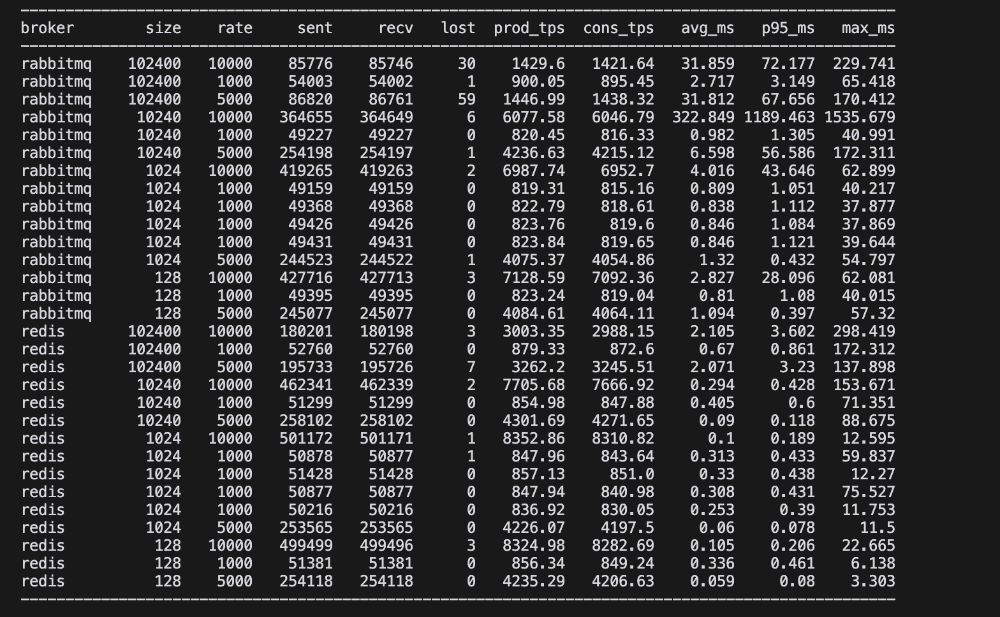
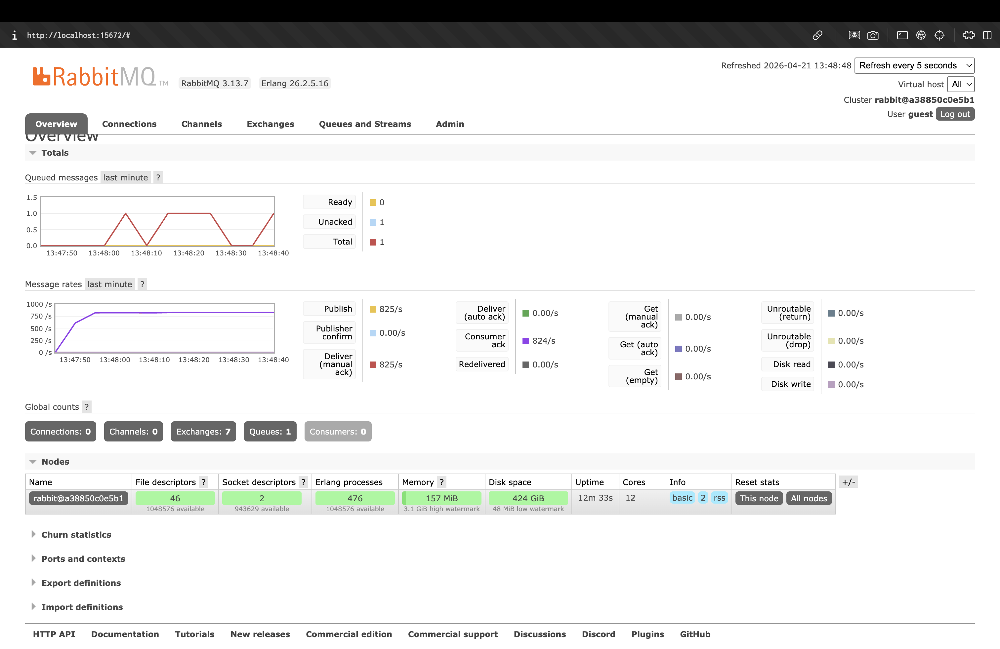

# ОТЧЕТ ПО ПРАКТИКЕ: СРАВНЕНИЕ RABBITMQ И REDIS КАК БРОКЕРОВ СООБЩЕНИЙ

## 1. ЦЕЛЬ И УСЛОВИЯ ЭКСПЕРИМЕНТА

**Цель:** Сравнить пропускную способность, влияние размера сообщения и стабильность `single instance` RabbitMQ и Redis в одинаковых условиях.

**Конфигурация стенда:**
* **Инфраструктура:** Брокеры развернуты в Docker-контейнерах с жесткими лимитами: **1.0 CPU** и **512 MB RAM**.
* **Инструментарий:** Скрипты `producer` и `consumer` на Python, запущенные на хостовой ОС (для исключения влияния сетевых задержек Docker).
* **Параметры:** Интенсивность потока 10 000 msg/sec, размеры сообщений от 128 B до 100 KB.

---

## 2. СВОДНАЯ ТАБЛИЦА РЕЗУЛЬТАТОВ (STRESS TEST: 10 000 MSG/SEC)

Данные соответствуют результатам тестирования при пиковой нагрузке (rate: 10 000).

| Брокер | Размер | Отправлено | Получено | Потери | Cons TPS | Avg Latency | P95 Latency |
| :--- | :--- | :--- | :--- | :--- | :--- | :--- | :--- |
| **RabbitMQ** | 128 B | 427 716 | 427 713 | 3 | 7 092.36 | 2.827 ms | 28.096 ms |
| **Redis** | 128 B | 499 499 | 499 496 | 3 | **8 282.69** | **0.105 ms** | **0.206 ms** |
| **RabbitMQ** | 1 KB | 419 265 | 419 263 | 2 | 6 952.70 | 4.016 ms | 43.646 ms |
| **Redis** | 1 KB | 501 172 | 501 171 | 1 | **8 310.82** | **0.100 ms** | **0.189 ms** |
| **RabbitMQ** | 10 KB | 364 655 | 364 649 | 6 | 6 046.79 | 322.849 ms | **1 189.463 ms** |
| **Redis** | 10 KB | 462 341 | 462 339 | 2 | **7 666.92** | **0.294 ms** | **0.428 ms** |
| **RabbitMQ** | 100 KB | 85 776 | 85 746 | 30 | 1 421.64 | 31.859 ms | 72.177 ms |
| **Redis** | 100 KB | 180 201 | 180 198 | 3 | **2 988.15** | **2.105 ms** | **3.602 ms** |

---

## 3. АНАЛИЗ ЭКСПЕРИМЕНТОВ

### Эксперимент 1: Базовое сравнение
На малых сообщениях (128 B) **Redis** работает эффективнее: его пропускная способность (TPS) выше на ~17%, а средняя задержка (Avg Latency) в 27 раз ниже, чем у RabbitMQ. Оба брокера справляются с потоком 10 000 msg/sec с минимальными потерями.

### Эксперимент 2: Влияние размера сообщения
* **Малые и средние данные (до 1 KB):** Оба брокера показывают стабильность, но Redis удерживает задержку в микросекундном диапазоне (~0.1 ms).
* **Тяжелые данные (100 KB):** При увеличении размера производительность падает у обоих. Однако **Redis** сохраняет приемлемый отклик (P95 = 3.6 ms), в то время как RabbitMQ показывает в 2 раза меньший TPS и в 20 раз большие задержки (72.1 ms).

### Эксперимент 3: Интенсивность и точка деградации
* **RabbitMQ:** Точка критической деградации зафиксирована на сообщениях **10 KB при 10 000 msg/sec**. Задержка P95 взлетает до **1.189 секунды**. Это классический признак переполнения буферов памяти (512 MB) и работы механизмов `flow control` (принудительное замедление Producer).
* **Redis:** Не демонстрирует резких скачков задержки. Деградация проявляется только в снижении пропускной способности (TPS) при обработке 100 KB сообщений (из-за лимита CPU), но система остается отзывчивой.

---

## 4. ВЫВОДЫ

* **Пропускная способность:** Лидером является **Redis**, стабильно выдающий более высокий TPS во всех тестах.
* **Устойчивость к нагрузке:** **Redis** значительно лучше переносит увеличение размера сообщения и интенсивности потока.
* **Точки деградации:** * `RabbitMQ`: деградирует на 10 KB / 10 000 msg/sec (Latency > 1 сек).
    * `Redis`: снижает TPS на 100 KB, но сохраняет стабильный Latency.
* **Инструментарий:** Использование Python-скриптов позволило выявить "потолок" каждой технологии в условиях дефицита ресурсов.

**Рекомендация:** Для систем с жесткими требованиями к Latency и ограниченными ресурсами (512 MB RAM) **Redis** является предпочтительным выбором. **RabbitMQ** требует большего объема оперативной памяти для стабильной работы с сообщениями среднего и большого размера.