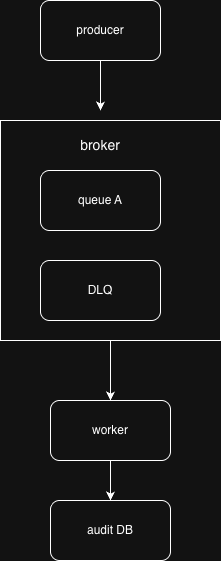

# Архитектурная схема



# Схема потоков сообщений

```mermaid
flowchart TD
    subgraph Normal_Path["Обычный путь"]
        P[Producer] --> B[Broker (queue A)]
        B --> W[Worker]
        W --> A[Audit (DB)]
        A -->|ACK| B
    end

    subgraph Error_Path["Путь ошибки"]
        B2[Broker (queue A)] --> W2[Worker]
        W2 -->|Ошибка| R[Retry N раз]
        R --> DLQ[DLQ (Dead Letter Queue)]
    end
```

# Как реализован exactly-once

### 1 Идентификация сообщений

Каждое сообщение, которое отправляет **producer**, имеет уникальный идентификатор, обычно называемый `event_id`.

* Этот `event_id` гарантирует, что даже если сообщение будет доставлено повторно (что возможно в асинхронных системах с брокером), мы сможем распознать его как дубликат.
* Без уникального идентификатора невозможно точно различить, было ли сообщение уже обработано или это новая попытка.

### 2️ Хранение состояния обработки

В системе есть база данных **audit (DB)**, в которой:

* Создана таблица для хранения результатов обработки сообщений.
* На поле `event_id` установлен **уникальный индекс**.

Это ключевой момент: уникальный индекс предотвращает вставку одной и той же записи несколько раз.

### 3️ Логика работы воркера (Worker)

Когда воркер получает сообщение из брокера:

1. Он **читает сообщение** и извлекает `event_id`.
2. Пытается записать результат обработки в таблицу `audit`.

   * Если запись проходит успешно, это значит, что сообщение обрабатывается впервые.
   * После успешной записи воркер отправляет **ACK брокеру**, подтверждая, что сообщение обработано.
3. Если сообщение уже было обработано (например, пришло повторно из-за сбоя сети или повторной доставки брокера):

   * Попытка вставки в таблицу `audit` **провалится** из-за уникального индекса (`duplicate key error`).
   * Воркер понимает, что это **дубликат**, и **не выполняет повторную обработку**.
   * Он всё равно отправляет **ACK брокеру**, чтобы повторная доставка не происходила снова.

### 4️ Обеспечение atomicity (атомарности)

Очень важный момент: запись в базу и подтверждение (ACK) должны быть логически **атомарными**:

* Либо сообщение записано в `audit` и ACK отправлен,
* Либо ничего не происходит, и сообщение остаётся в очереди для повторной попытки.

Это гарантирует, что ни один шаг не будет «потерян», и обработка не произойдёт дважды.

### 5️ Обработка повторных доставок

Даже если брокер повторно доставит сообщение (например, после тайм-аута или сбоя воркера):

* Воркер проверяет `event_id` через уникальный индекс в базе.
* Сообщение распознаётся как уже обработанное.
* Воркер **не выполняет повторно обработку**, но отправляет ACK, чтобы брокер удалил сообщение из очереди.

### 6️ Итог

Таким образом, комбинация трёх вещей обеспечивает **exactly-once**:

1. **Уникальный идентификатор сообщения (`event_id`)** — для распознавания повторов.
2. **Уникальный индекс в таблице `audit`** — предотвращает повторную обработку на уровне базы данных.
3. **Логика воркера с атомарной записью и отправкой ACK** — гарантирует, что обработка и подтверждение происходят только один раз.

В итоге, даже если сообщения доставляются брокером несколько раз, система **обрабатывает каждое событие ровно один раз**, а дубликаты игнорируются безопасным образом.

# Как работает DLQ

## DLQ (Dead Letter Queue)

DLQ — это отдельная очередь для сообщений, которые не удалось обработать обычным потоком. Она служит «страховочной сеткой», позволяя безопасно выявлять, анализировать и повторно обрабатывать проблемные сообщения.

### Как это работает

В архитектуре сообщение от **producer** попадает в брокер в очередь **queue A**, затем его забирает **worker**. Worker пытается обработать сообщение и записать результат в базу **audit (DB)**. Если обработка проходит успешно, воркер отправляет **ACK** брокеру, и сообщение считается обработанным.

Если во время обработки возникает ошибка — например, сбой логики, недоступность базы данных или некорректный формат сообщения — сообщение не может быть обработано обычным способом.

Для таких случаев используется механизм **retry**: воркер повторно пытается обработать сообщение несколько раз (обычно N раз), иногда с задержкой или экспоненциальным увеличением интервала между попытками.

Если после всех попыток сообщение всё ещё не удаётся обработать, оно помещается в **DLQ**. После этого оно больше не мешает основному потоку обработки.

### Цели использования DLQ

- **Ручной анализ** — проблемное сообщение можно изучить и определить причину ошибки.
- **Повторная обработка после исправления** — после устранения причины сообщение можно повторно отправить в обычную очередь.
- **Логирование проблемных сообщений** — DLQ позволяет вести статистику и отчёты по сообщениям, которые не удалось обработать, что помогает улучшать систему и предотвращать повторение ошибок.

### Итог

DLQ обеспечивает **надёжность и устойчивость системы**: даже если отдельные сообщения постоянно вызывают ошибки, основной поток продолжает работать, а проблемные сообщения аккумулируются для дальнейшего анализа и безопасной обработки.

