# Отчёт: практика «Аномалии изоляции в SQL»

**СУБД:** PostgreSQL 16 (Docker, контейнер `sql_isolation_pg`)  
**База данных:** `isolation_lab`  
**Подключение:** `localhost:5433`, пользователь `postgres`  
**Среда:** pgAdmin 4, два окна Query Tool (сессии T1 и T2)

**Сдаётся:**
- SQL-скрипты: `setup.sql`, папки `01_dirty_read/` … `04_lost_update/`
- Отчёт: этот файл + скриншоты в каталоге `image/`

---

## 1. Выбранные аномалии

Выполнены **все четыре** пункта из задания:

| № | Аномалия | Таблица | Скрипты |
|---|----------|---------|---------|
| 1 | Dirty read | `bank_accounts` | `01_dirty_read/` |
| 2 | Non-repeatable read | `employees` | `02_non_repeatable_read/` |
| 3 | Phantom read | `products` | `03_phantom_read/` |
| 4 | Lost update | `warehouse` | `04_lost_update/` |

Для **lost update** дополнительно показаны способы предотвращения: `SELECT … FOR UPDATE` и optimistic locking (колонка `version`).

---

## 2. Общая подготовка

### 2.1. Создание таблиц

Выполнен скрипт `setup.sql` — созданы четыре таблицы с тестовыми данными.

### 2.2. Порядок запуска каждого сценария

1. Подключиться к базе **`isolation_lab`**.
2. Выполнить **`init.sql`** соответствующей папки.
3. Открыть две вкладки Query Tool: **T1** и **T2**.
4. Запустить **`t1.sql`** (или `t1_lost.sql` и т.д.), через 1–2 секунды — **`t2.sql`**.
5. Зафиксировать результат в Data Output (скриншоты ниже).

Автозапуск (по желанию): `./run.sh` или `python run.py` — логи в `logs/latest/`.

---

## 3. Dirty Read (грязное чтение)

### 3.1. Таблица и данные

Таблица `bank_accounts`. У записи `id = 1` (Алиса) баланс **5000.00**.

### 3.2. Две параллельные транзакции

| | T1 (`t1.sql`) | T2 (`t2.sql`) |
|---|---------------|---------------|
| Уровень | `READ COMMITTED` | `READ UNCOMMITTED` (в PostgreSQL = `READ COMMITTED`) |
| Действия | `UPDATE` −2000 → 3000, `pg_sleep(10)`, `ROLLBACK` | `SELECT balance` пока T1 открыта |

### 3.3. Шаги воспроизведения

1. `01_dirty_read/init.sql`
2. Сессия T1: `t1.sql`
3. Сессия T2: `t2.sql` (пока T1 не завершилась)

### 3.4. Результат

**Исходные данные:**

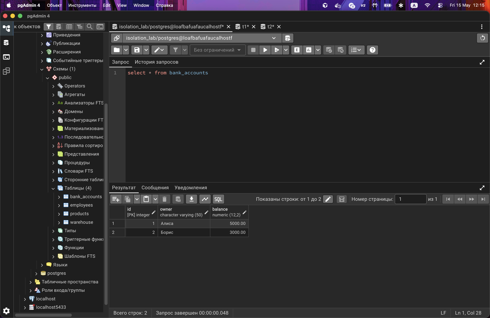

**T1** — незакоммиченное значение 3000, после отката снова 5000:

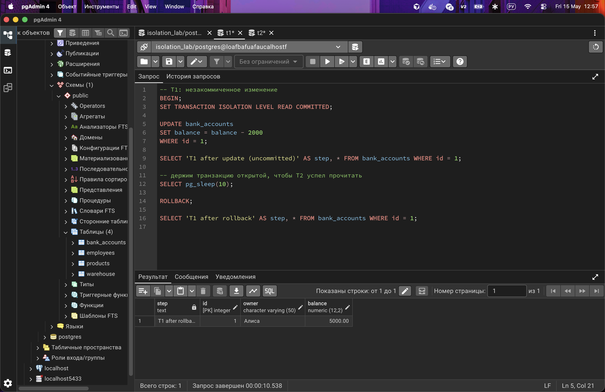

**T2** — чтение при открытой T1:

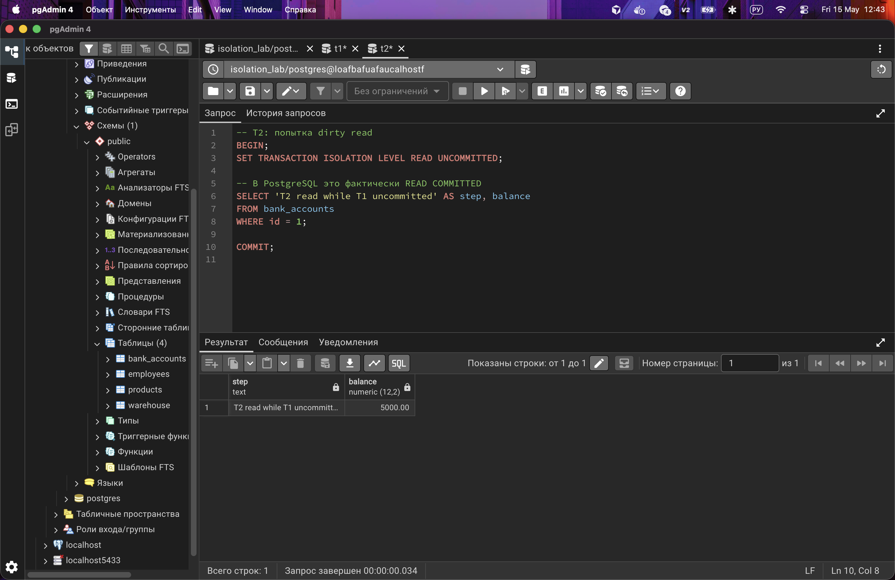

**Вывод:** T2 видит **5000.00**, а не 3000.00. В PostgreSQL **грязное чтение не воспроизводится** (MVCC, уровень `READ UNCOMMITTED` фактически как `READ COMMITTED`).

### 3.5. Как избежать

- Использовать **`READ COMMITTED`** и выше (в PostgreSQL — по умолчанию).
- Не ожидать чтения незакоммичённых данных в PostgreSQL.

---

## 4. Non-repeatable Read (неповторяемое чтение)

### 4.1. Таблица и данные

Таблица `employees`. Сотрудник `id = 1` (Иванов), зарплата **50000.00**.

### 4.2. Две параллельные транзакции

| | T1 (`t1.sql`) | T2 (`t2.sql`) |
|---|---------------|---------------|
| Действия | два `SELECT salary`, между ними `pg_sleep(10)` | через 3 с: `UPDATE salary = 65000`, `COMMIT` |

### 4.3. Шаги воспроизведения

1. `02_non_repeatable_read/init.sql`
2. Параллельно `t1.sql` и `t2.sql`

### 4.4. Результат

**Подготовка:**

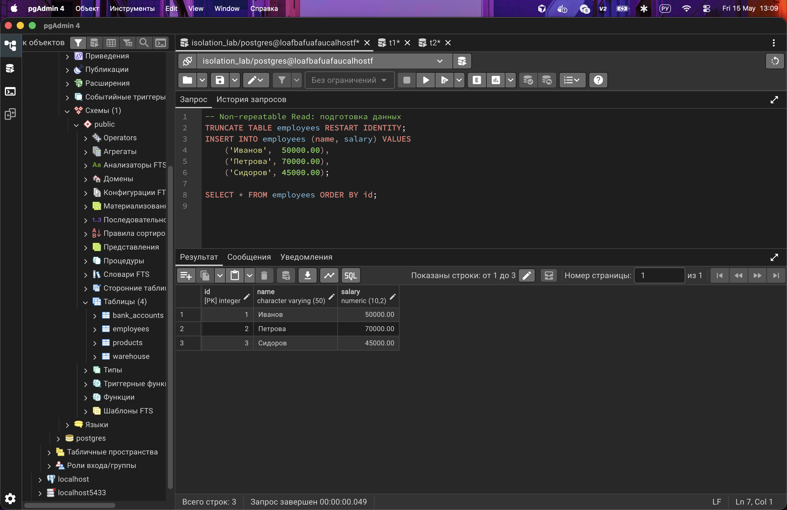

**T2** — обновление и commit:

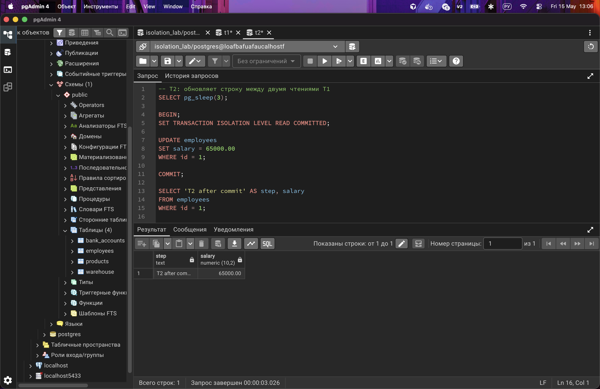

**T1** — второе чтение дало **другое** значение:

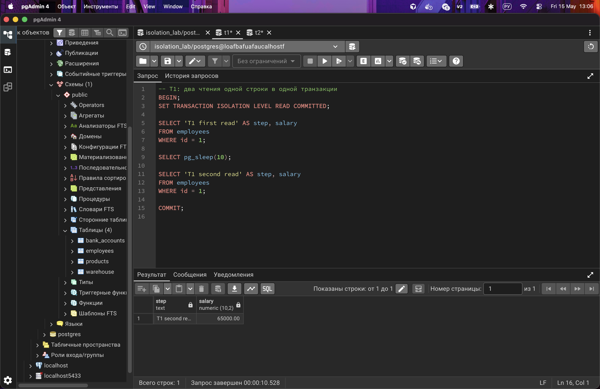

**Вывод:** в одной транзакции T1 первое чтение — **50000**, второе — **65000**. Аномалия **воспроизведена** на уровне `READ COMMITTED`.

### 4.5. Как избежать

```sql
SET TRANSACTION ISOLATION LEVEL REPEATABLE READ;
-- или SERIALIZABLE
```

---

## 5. Phantom Read (фантомное чтение)

### 5.1. Таблица и данные

Таблица `products`. Запрос: `COUNT(*)` WHERE `price > 30000` — изначально **3** строки.

### 5.2. Две параллельные транзакции

| | T1 (`t1.sql`) | T2 (`t2.sql`) |
|---|---------------|---------------|
| Действия | два одинаковых `COUNT(*)`, `pg_sleep(10)` | `INSERT` «Видеокарта» 60000, `COMMIT` |

### 5.3. Шаги воспроизведения

1. `03_phantom_read/init.sql`
2. Параллельно `t1.sql` и `t2.sql`

### 5.4. Результат

**Подготовка:**

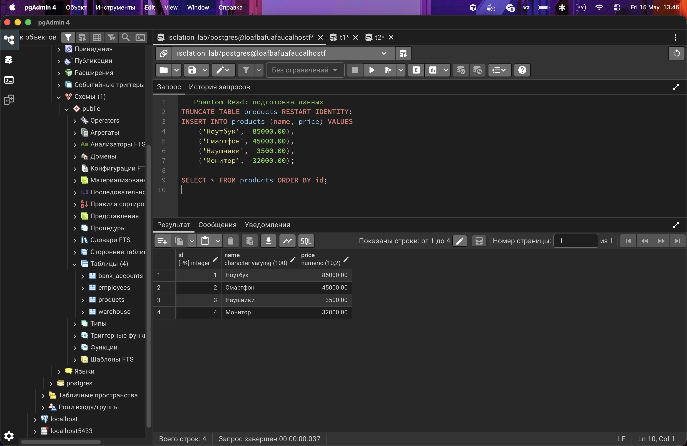

**T1** — второй подсчёт **4** (было 3):

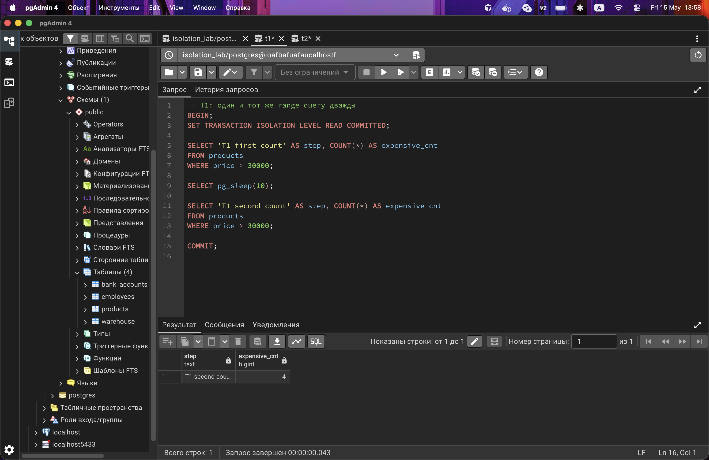

**T2** — вставка строки в тот же диапазон:

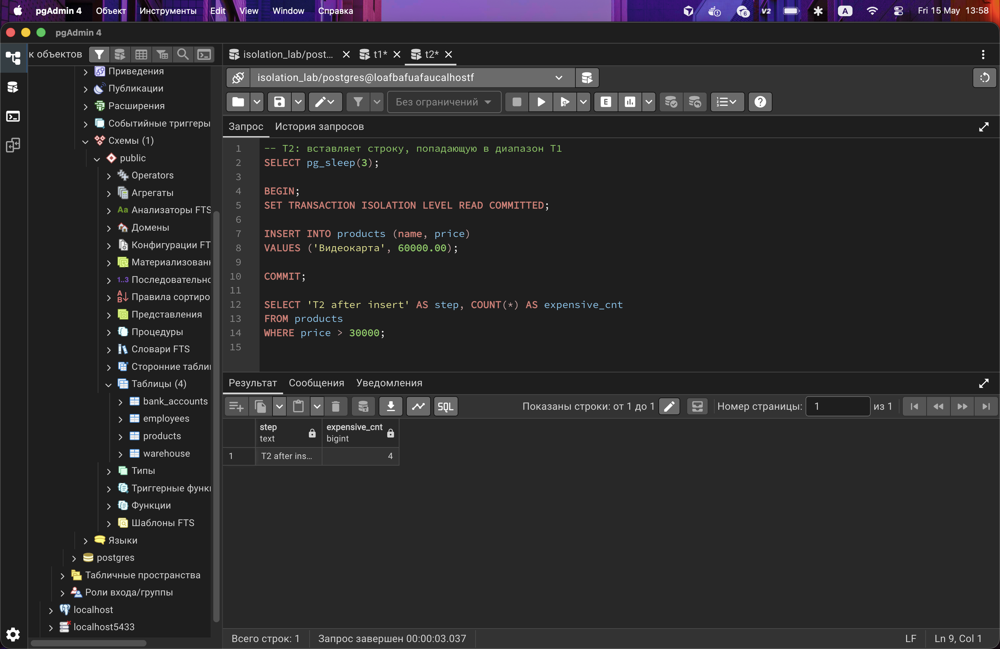

**Вывод:** во втором range-query появилась «фантомная» строка — count **3 → 4**. Аномалия **воспроизведена**.

### 5.5. Как избежать

- `REPEATABLE READ` (в PostgreSQL — согласованный snapshot в транзакции).
- При необходимости — `SERIALIZABLE`.

---

## 6. Lost Update (потерянное обновление)

### 6.1. Таблица и данные

Таблица `warehouse`. Товар `id = 1`, **quantity = 10**.

### 6.2. Две параллельные транзакции (проблемный сценарий)

| | T1 (`t1_lost.sql`) | T2 (`t2_lost.sql`) |
|---|-------------------|-------------------|
| Действия | читает 10, пишет `quantity = 7` (10−3) | читает 10, пишет `quantity = 5` (10−5) |

Ожидаемый результат при корректной последовательности: **2** (10−3−5).  
Фактический — **7** (обновление T2 потеряно).

### 6.3. Шаги воспроизведения

1. `04_lost_update/init.sql`
2. Параллельно `t1_lost.sql` и `t2_lost.sql`

### 6.4. Результат (аномалия)

**T1** — чтение исходного значения:

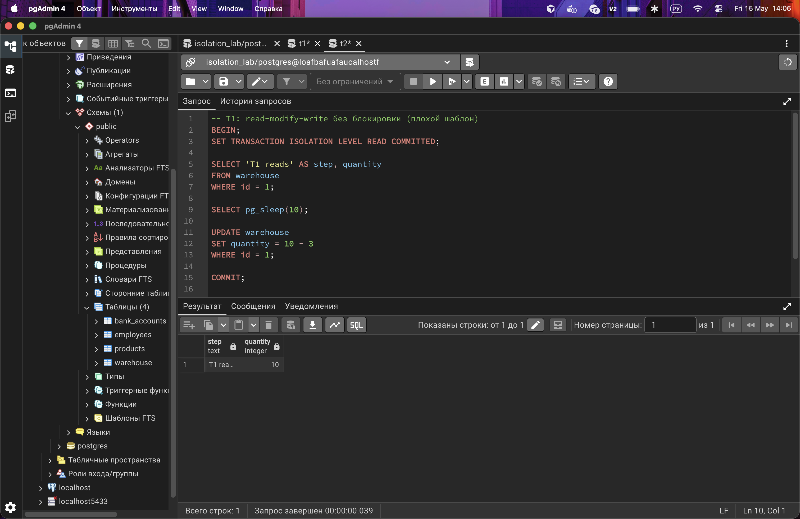

**T1** — итог в БД после обеих транзакций:

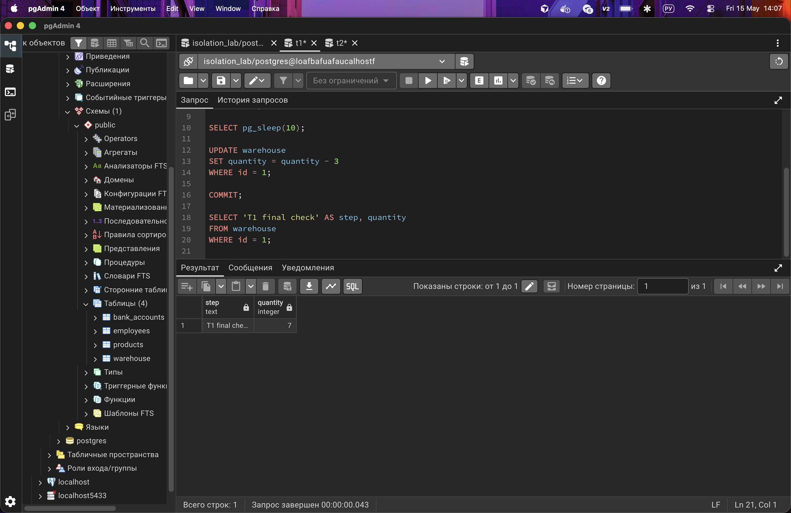

**Вывод:** обе транзакции читали **10**, но T1 записала **7** поверх изменения T2. Одно списание **потеряно** — классический **lost update** при шаблоне read-modify-write без блокировки.

### 6.5. Как избежать (продемонстрировано)

#### Способ 1: пессимистичная блокировка `FOR UPDATE`

Скрипты: `t1_for_update.sql`, `t2_for_update.sql`.

**T1** — блокировка строки:

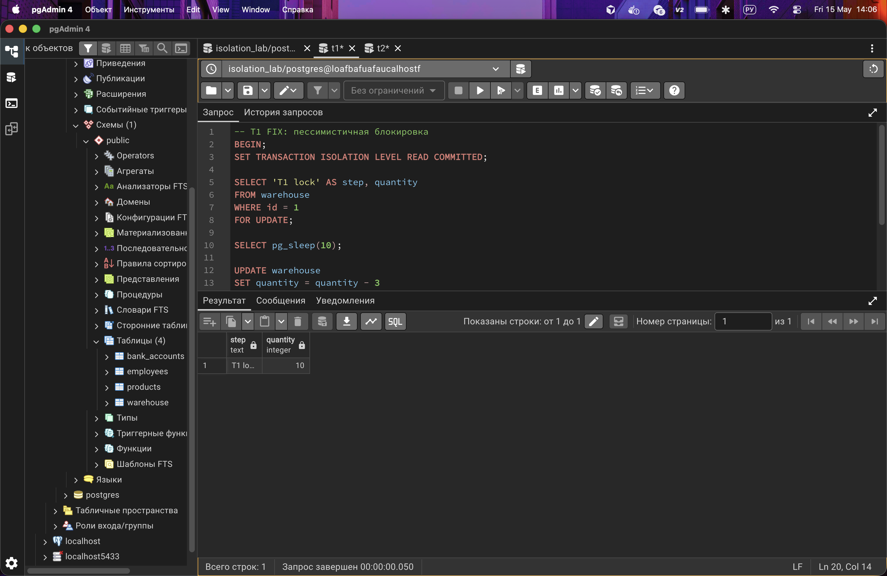

**T2** — ожидание lock и корректный финал **2** (7−5):

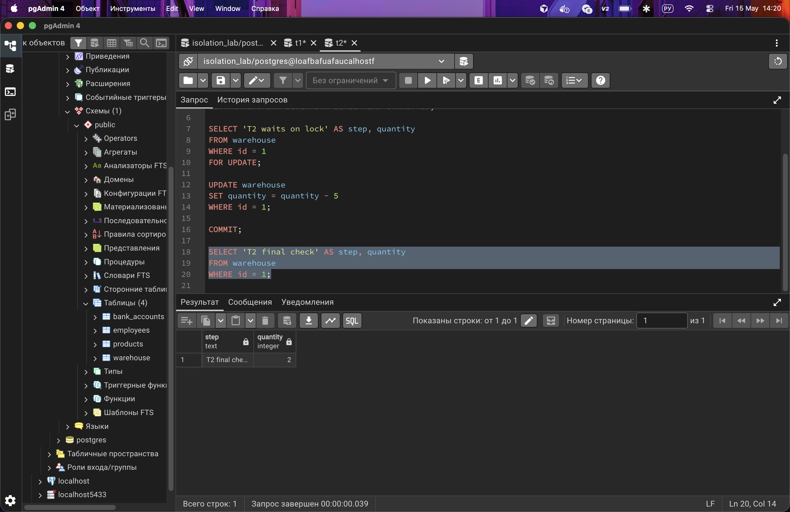

#### Способ 2: optimistic locking (версия строки)

Скрипты: `optimistic_prepare.sql`, `t1_optimistic.sql`, `t2_optimistic.sql`.

**Подготовка** — колонка `version`:

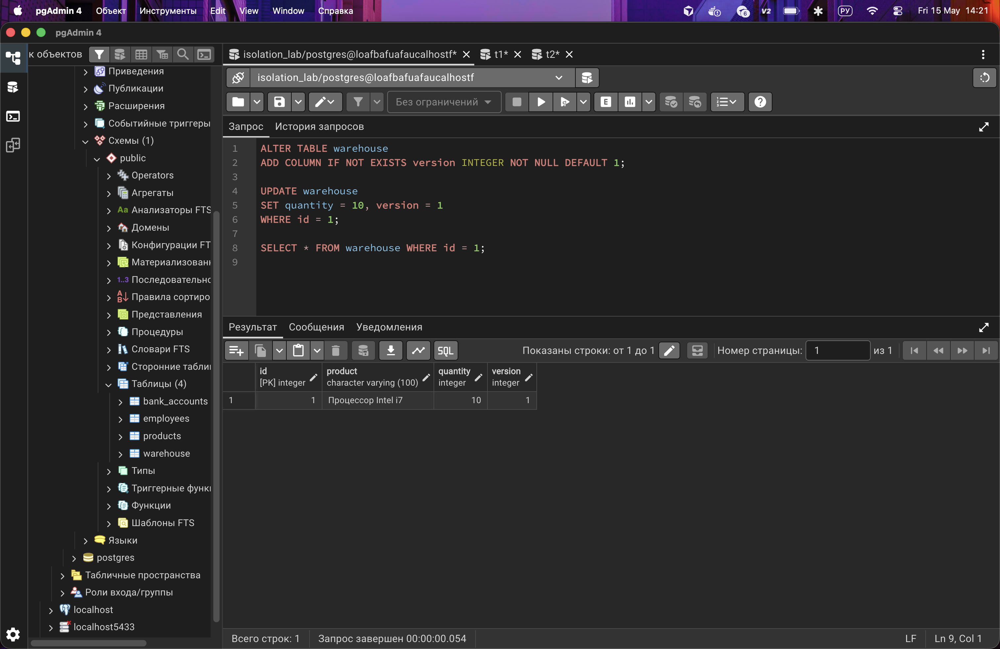

**T2** — успешное обновление (`UPDATE 1`):

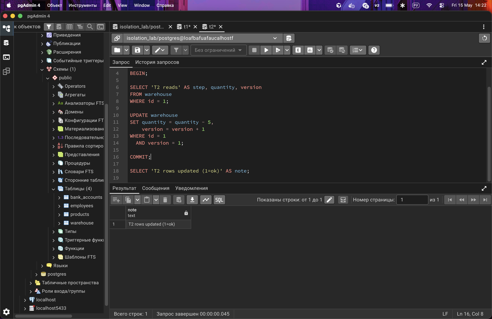

**T1** — версия уже изменена (конфликт; далее `UPDATE 0`):

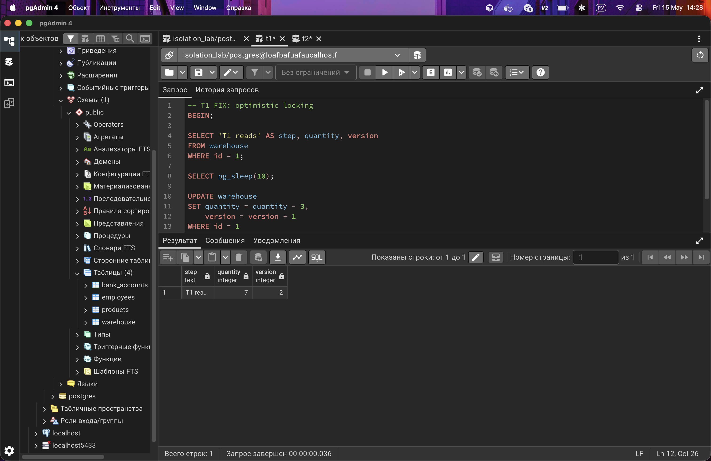

**Вывод:** T2 успела закоммитить с `version = 2`; T1 при `UPDATE … WHERE version = 1` не обновляет строку — **lost update предотвращён**.

#### Способ 3: атомарный UPDATE

```sql
UPDATE warehouse SET quantity = quantity - 3 WHERE id = 1;
```

без предварительного чтения в приложении.

---

## 7. Сводная таблица

| Аномалия | Воспроизведена? | Уровень / причина | Предотвращение |
|----------|-----------------|-------------------|----------------|
| Dirty read | Нет (особенность PostgreSQL) | MVCC, RC = RU | `READ COMMITTED+` |
| Non-repeatable read | **Да** | `READ COMMITTED` | `REPEATABLE READ`, `SERIALIZABLE` |
| Phantom read | **Да** | `READ COMMITTED` | `REPEATABLE READ`, `SERIALIZABLE` |
| Lost update | **Да** | read-modify-write | `FOR UPDATE`, `version`, атомарный UPDATE |

---


